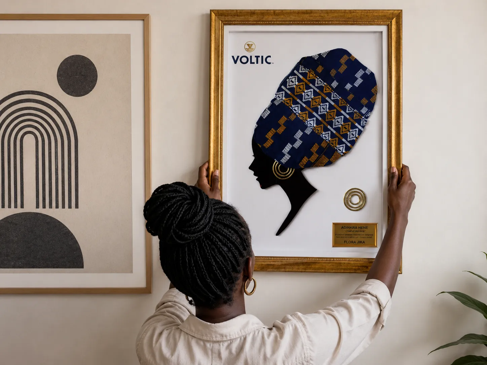

<div align="center">
  
  # 🖼️ CraftHive 
  
  **Premium Custom Framing & Art Studio**
  
  [](https://nextjs.org/)
  [](https://react.dev/)
  [](https://www.typescriptlang.org/)
  [](https://tailwindcss.com/)
  [](https://gsap.com/)

  [View Live Site](https://crafthivegh.com) • [Report Bug](#-support) • [Request Feature](#-support)

</div>

---

## 🌟 About The Project

**CraftHive** is a premium, ultra-modern e-commerce platform and digital gallery for custom picture framing, Adinkra-inspired shadow boxes, personalized wooden gifts, and bespoke signage.

Built with performance and aesthetics in mind, this project utilizes **Next.js 16 App Router**, **GSAP** for buttery smooth scrolling animations, and **View Transitions** for a native app-like experience.

### 📸 Showcase

| Custom Framing | Dynamic Galleries |
| :---: | :---: |
|  |  |

---

## 🚀 Key Features

- **⚡ Blazing Fast Performance:** Heavy images are automatically optimized to modern formats (WEBP) and lazy-loaded. 
- **✨ Immersive GSAP Animations:** Features complex scroll-triggered animations, split-text typography reveals, and parallax image galleries.
- **📱 Responsive & Accessible:** Fully functional across all devices with native smooth scrolling powered by `lenis`.
- **🖼️ View Transitions:** Seamless routing between pages with `next-view-transitions` for zero-flicker UI updates.
- **📊 Real-time Analytics:** Integrated deeply with Vercel Web Analytics and Speed Insights to track Core Web Vitals (INP, LCP, etc.).

---

## 🛠️ Tech Stack

- **Framework:** Next.js (App Router)
- **Language:** TypeScript
- **Styling:** Tailwind CSS + Custom CSS modules
- **Animations:** GSAP & Framer Motion
- **Scrolling:** Lenis
- **Hosting:** Vercel

---

## 💻 Getting Started

Follow these steps to run the CraftHive platform locally on your machine.

### Prerequisites

You will need **Node.js** (v18+) and **pnpm** installed on your system.

```bash
npm install -g pnpm
```

### Installation

1. **Clone the repository:**
   ```bash
   git clone https://github.com/davecodelab/CHDEMO.git
   cd CHDEMO
   ```

2. **Install dependencies:**
   ```bash
   pnpm install
   ```

3. **Run the development server:**
   ```bash
   pnpm run dev
   ```

4. **Open your browser:**
   Navigate to `http://localhost:3000` to see the site in action!

---

## 🏗️ Project Structure

```text
src/
├── app/                  # Next.js App Router (Pages & Layouts)
│   ├── about/            # About page
│   ├── gallery/          # Dynamic gallery showcase
│   └── services/         # Custom Framing & Shadow Boxes
├── components/           # Reusable React UI Components
│   ├── Animates/         # GSAP SplitText wrappers
│   ├── GalleryParallax/  # Scroll-driven image galleries
│   └── Preloader/        # Initial site load animation
└── ...
```

---

## 📈 Vercel Deployment

This project is optimized for deployment on Vercel. 
Ensure you have the Vercel CLI installed or link this repository to your Vercel dashboard.

```bash
pnpm install -g vercel
vercel deploy
```

> **Note:** The `pnpm-lock.yaml` file is highly strict. Do not mix package managers (like `npm` or `yarn`) or Vercel builds will fail.

---

<div align="center">
  <p>Made with ❤️ by CraftHive.</p>
</div>
